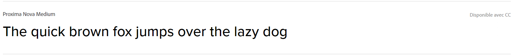

# Script d'automatisation de génération de NewsLetter
## Contexte
*Cours de **Web Communication***\
*Formateur : **[Arthur Lemasson](https://www.linkedin.com/in/arthur-lemasson-0b6589b1/)***\
*École : **[Sup de Vinci](https://www.supdevinci.fr/)***

## Explication
Le script utilise l'api de **[ProductHunt](https://api.producthunt.com/v2/docs)** pour récupérer les 5 outils les plus populaires de la semaine en rapport avec "developer-tools".
Il remplace ensuite une partie d'une template HTML pour ajouter un tableau avec ces 5 produits.
Une NewsLetter automatique sous forme d'un fichier en *.html* est donc générée automatiquement.
Il suffit donc de modifier le fichier template pour synchroniser les changements sur les futures newletter.

## Design
Utilisation du site [Coolors](https://coolors.co/) et de la palette :

Utilisation de la police d'écriture **Proxima Nova** :

- [Lien](https://coolors.co/palette/e63946-f1faee-a8dadc-457b9d-1d3557) vers la palette.
- [Lien](https://fonts.adobe.com/fonts/proxima-nova#fonts-section) vers la police d'écriture.

### Inspiration 
- https://www.behance.net/gallery/167534943/ACC-Web-Design
- https://www.awwwards.com/
- https://reallygoodemails.com/